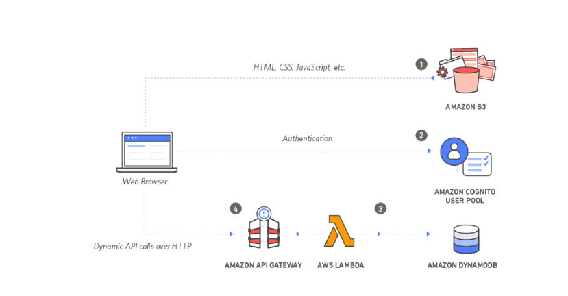
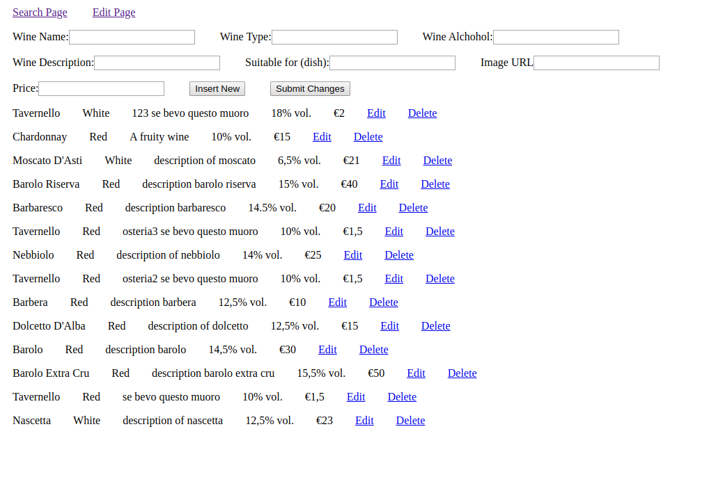

Nicolò Tambone 267259

# PDGT Project: 
## A stub for RESTful APIs implemented with AWS Lambda and AWS API Gateway

This repository contains the code and the documentation of a small but fully functional RESTful web service based on the serverless technology available from Amazon AWS. The PDGT Project implements a simple catalog of a fictitious wines producer or distributor. The API allows to search the catalog for some given parameters such as wine name, suitable dishes, price range and others. Moreover it's possible to edit or delete entries. In short it implements a basic CRUD system. The current release lacks of authentication features which unfortunately were not implemented due to a lack of time. Nevertheless these features may easily be integrated in a future release using AWS Cognito.

# Architecture overview

The PDGT Project API are written in Python 3.8. The code runs on a service named AWS Lambda which is a serverless platform. Depending on its complexity and workload, every method implemented in AWS Lambda may be given a different scale of resources. The method itself is triggered by an external service, namely AWS API Gateway, which implements the routes and the HTTP methods involved  with the actual API call. Also, AWS API Gateway exposes the public URLs for the API calls.
Data is stored on AWS DynamoDB, which is a high-performance NoSQL database.



# Why a serverless solution?

A serverless based API has many advantages in terms of reduced complexity, cost effectiveness and time-to-deliver, expecially in the case of small applications used sporadically and with a light workload for which setting up a fully functional server would result in system resources waiting idle for most of the time. Nevertheless AWS Lambda can scale easily and effectively to huge dimensions if required. 

# Main architectural components

The API in itself is based on AWS API Gateway to handle the URLs, AWS Lambda for the login and AWS Dynamo DB for data storage. Another service, namely AWS S3, has been employed to host a minimal client based on  HTML and javascript.

* [More info on AWS S3](https://aws.amazon.com/it/s3/getting-started/)
* [More info on AWS DynamoDB](https://aws.amazon.com/it/dynamodb/)
* [More info on AWS Lambda](https://docs.aws.amazon.com/it_it/lambda/latest/dg/welcome.html)
* [More info on AWS API Gateway](https://aws.amazon.com/it/api-gateway/)


# API Description and Documentation

## Open API Documentation
```
{
  "PDGT-Project": "1.0",
  "info": {
    "version": "1.0.0",
    "title": "PDGT-Project",
    "description": "A sample API to browse and edit a catalog of wines",
    "termsOfService": "",
    "contact": {
      "name": "Nicolò Tambone",
      "email": "n.tambone@campus.uniurb.it",
      "url": ""
    },
    "license": {
      "name": "MIT",
      "url": "https://opensource.org/licenses/MIT"
    }
  },
  "host": "amazonaws.com",
  "basePath": "/wines",
  "schemes": [
    "http"
  ],
  "consumes": [
    "application/json"
  ],
  "produces": [
    "application/json"
  ],
  "paths": {
    "/wines": {
      "get": {
        "description": "Search through the catalog for specific wines. Also, list the full catalog.",
        "operationId": "searchWines",
        "parameters": [
          {
            "name": "searchCriteria",
            "in": "query",
            "description": "All | Key | Filter; All = list full catalog; Key = find a specific record; Filter = specify a query condition",
            "required": false,
            "type": "string",
            "collectionFormat": "json",
            "items": {
              "type": "string"
            }
          },
          {
            "name": "WineId",
            "in": "query",
            "description": "Key value of the item",
            "required": false,
            "type": "string"
          },
          {
            "name": "WineName",
            "in": "query",
            "description": "Name of the wine e.g. Chardonnay",
            "required": false,
            "type": "string"
          },
          {
            "name": "WineType",
            "in": "query",
            "description": "Type of the wine Red | White",
            "required": false,
            "type": "string"
          },
          {
            "name": "WineDishes",
            "in": "query",
            "description": "Suitable dishes e.g. cheese",
            "required": false,
            "type": "string"
          },
          {
            "name": "From",
            "in": "query",
            "description": "Starting from price",
            "required": false,
            "type": "string"
          },
          {
            "name": "To",
            "in": "query",
            "description": "Top price",
            "required": false,
            "type": "string"
          }
        ],
        "responses": {
          "200": {
            "description": "pet response",
            "schema": {
              "type": "json",
              "items": {
                "$ref": "#/definitions/Wine"
              }
            }
          },
          "default": {
            "description": "unexpected error",
            "schema": {
              "$ref": "#/definitions/Error"
            }
          }
        }
      },
      "put": {
        "description": "Inserts or update a wine in the catalog",
        "operationId": "addPet",
        "parameters": [
          {
            "name": "WineName",
            "in": "body",
            "description": "Name of the wine e.g. Chardonnay",
            "required": true,
            "type": "string"
          },
          {
            "name": "WineType",
            "in": "body",
            "description": "Type of the wine Red | White",
            "required": true,
            "type": "string"
          },
          {
            "name": "WineDishes",
            "in": "body",
            "description": "Suitable dishes e.g. cheese",
            "required": true,
            "type": "string"
          },
          {
            "name": "From",
            "in": "body",
            "description": "Starting from price",
            "required": true,
            "type": "string"
          },
          {
            "name": "To",
            "in": "body",
            "description": "Top price",
            "required": true,
            "type": "string"
          }
        ],
        "responses": {
          "200": {
            "description": "pet response",
            "schema": {
              "$ref": "#/definitions/Pet"
            }
          },
          "default": {
            "description": "unexpected error",
            "schema": {
              "$ref": "#/definitions/Error"
            }
          }
        }
      }
    },
    "/wines?searchCriteria=Key&WineId={id}": {
      "get": {
        "description": "Returns a wine based on a single WineId",
        "operationId": "find wine by id",
        "parameters": [
          {
            "name": "WineId",
            "in": "path",
            "description": "ID of wine to fetch",
            "required": true,
            "type": "string",
          }
        ],
        "responses": {
          "200": {
            "description": "pet response",
            "schema": {
              "$ref": "#/definitions/Pet"
            }
          },
          "default": {
            "description": "unexpected error",
            "schema": {
              "$ref": "#/definitions/Error"
            }
          }
        }
      },
      "delete": {
        "description": "deletes a single wine on the ID supplied",
        "operationId": "deleteWine",
        "parameters": [
          {
            "name": "WineId",
            "in": "path",
            "description": "ID of wine to fetch",
            "required": true,
            "type": "string",
          }
        ],
        "responses": {
          "204": {
            "description": "wine deleted"
          },
          "default": {
            "description": "unexpected error",
            "schema": {
              "$ref": "#/definitions/Error"
            }
          }
        }
      }
    }
  },
  "definitions": {
    "Wine": {
      "type": "object"
    },
    "NewWine": {
      "type": "object"
    },
    "Error": {
      "type": "object",
      "required": [
        "code",
        "message"
      ],
      "properties": {
        "code": {
          "type": "integer",
          "format": "int32"
        },
        "message": {
          "type": "string"
        }
      }
    }
  }
}
```

# A brief Overview of the methods implemented in the API

The PDGT-Project API implements three main methods: GET, PUT and DELETE. The method GET is flexible. It allows to retrieve data in three different modes: 

* All data in the Wines Table
* A single record by Id
* A set of records (or none) based on a detailed query


## GET

As mentioned before, the GET method implements three variants. This is achieved through the parameter ```searchCriteria``` which may have one of the following values:```All | Key | Filter```. If ```searchCriteria=All``` no trailing parameters will be necessary. If ```searchCriteria=Key``` then the subsequent parameter ```WineId=<ID>``` is required. If ```searchCriteria=Filter``` then a series of further query parameters is required.

####Examples
1. Retrieve everything: ```<base URL>/wines?searchCriteria=All```
1. Retrieve a single record: ```<base URL>/wines?searchCriteria=Key&WineId=barolo```
1. Retrieve a set of records based on a query: ```<base URL>/wines?searchCriteria=Filter&WineName=Barolo&WineType=ANY&WineDishes=ANY&From=0&To=9999```

Please, take note that with ```searchCriteria=Filter``` all the subsequent parameters are required. Fields not belonging to the query will assume either the value ANY or 0 or 9999.


## PUT

The following method is used to perform either insert or update. Thus for the update we'll take care to validate all the fields, not only the one or the ones to be updated. Also it's worth noting that the API actually receives a JSON body, thus we may have comfortably exploited this feature. However, due to a lack of time, we couldn't figure out exactly how to configure the API Gateway to achieve this. So we stuck to a more cumbersome style of parameters passing. For example, an insert (or update), may look like the following:

```<base URL>/wines-update?Verb=Insert&WineId=K3yStr1n5&WinePrice=10&WineAlchohol=8&WineDescription=desc&WineDishes=meat&WineImgURL=example.com&WineName=Pinot&WineType=White```

## DELETE

To delete a record, simply call the API with a method DELETE and two parameters: ```Verb=Delete``` and the subsequent key, for example: ```WineId=K3yStr1n5```. The resulting URL will look like the following:

```<base URL>/wines-delete?Verb=Delete&WineId=K3yStr1n5```

#Note on the Base URL
Needless to say that the before mentioned base URL is not the same URL as the one of the client's web page, but it's the one of the actual Web Service and it's given by the API Gateway configuration process.

# AWS Lambda Implementation

The actual implementation (Python 3.8) of the API is reported in this repository. The folders GET and PUT each contain a file named lambda_function.py which are, respectively, the implementation of the GET method and of the PUT and DELETE methods. To differentiate among two different lambda function was not mandatory. The logic may have been gathered in the same block of code. Anyway, having two small and separated pieces of code to manage different things is not a bad choice. Please, take note that adequate configuring of a role for authorization among different AWS services is mandatory. In this case, our AWS Lambda is between the API Gateway and the DynamoDb, thus we need a well configured role to be able to interact with both services.

# AWS API Gateway configuration

Configuring this service looks a little bit tricky, at least when you do it for the first time. Anyway one of the most important things to remember is to map the parameters with the json model used by the API. the AWS directory in the present repository contains the maps model for the methods in use.

# AWS Dynamo DB

This is a very convenient and easy to use data support for the API. It is a very performant NoSQL database, more suitable in this case than a RDBMS which, moreover, would have been a more expensive service.

# AWS S3

AWS S3 would not have been mandatory to have a functioning API. Nevertheless it came very useful to host the client, namely just a couple of web pages with javascript functionalities. To use S3 to host html pages, it is necessary to create a new bucket, giving it public read permissions. Then you need to activate the web hosting functionality in the properties page. Finally, just upload the files, and you're done.

# The client

Here is a minimalistic client which enables the minimum features required to test the API. Actually it's quite shabby, but unfortunately had to fix a lot of more important issues and lacked the time to work on a pleasant interface. Anyway, the search page presents some fields and a search button. If you just press the button without filling any field, you'll get out the entire list of records. (This is actually non suitable for a production system which may have millions of records!). Otherwise, you may search for example, by Wine Type filling in either "Red" or "White" (case sensitive).


Similarly, there's an edit page which allows to modify and delete records. (Calling PUT/DELETE of our API).



(I'm going to improve this ugly interface asap!)


# The configuration file config.js

Please, take note that the current repository doesn't include the config.js file in static/js/config. Change the URLs, according to your own settings.
```
var api_get_url          = "https://<API>.amazonaws.com/release/wines?searchCriteria=All";
var api_base_url_update  = "https://<API>.amazonaws.com/release/wines-update?";
var api_base_url_get_key = "https://<API>.amazonaws.com/release/wines?";
var api_base_url_delete  = "https://<API>.amazonaws.com/release/wines-delete?";
```


# License

[MIT](https://opensource.org/licenses/MIT)
